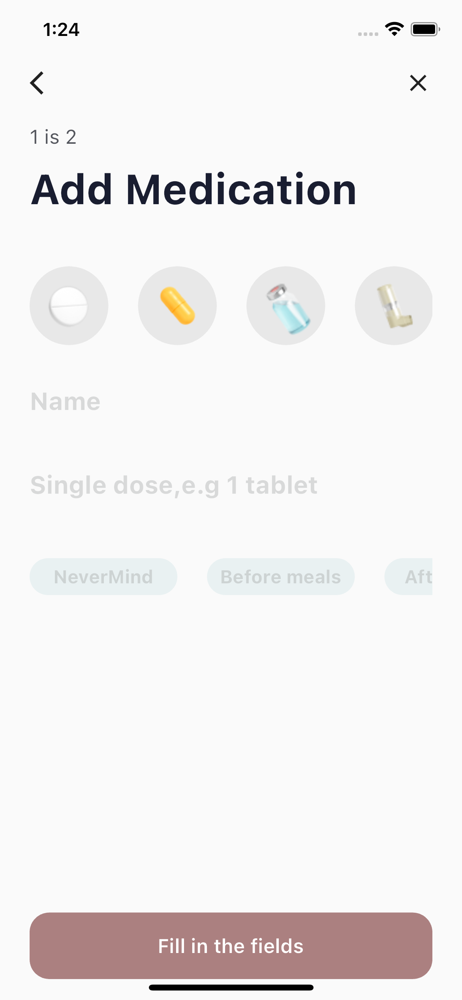
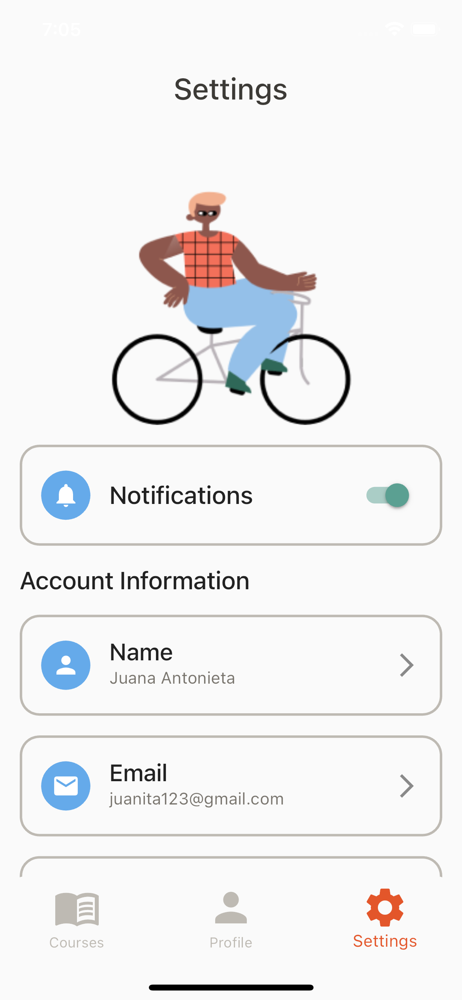

# Education Tech

"EduLearn," an innovative education learning app designed to revolutionize the way students learn and acquire knowledge. EduLearn provides a comprehensive platform that combines interactive lessons, engaging exercises, and personalized learning experiences, making education both effective and enjoyable. 

## ScreenShots:

